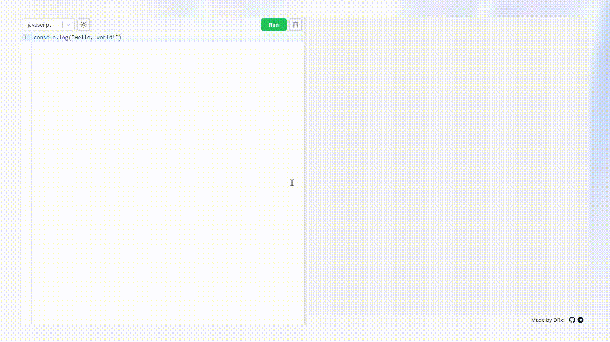

# CodeZone Backend

Backend for CodeZone online compiler

CodeZone - online compiler which executes user's code (for now without any inputs) in docker containers.

CodeZone can be tested [here](https://codezone.wdrxxx.online/) and fronted repo can be found [here](https://github.com/wDRxxx/CodeZone-frontend)

## Mini demo:

## How to run

### Using docker

1. `docker-compose up -d --build`

### Without docker

1. `go mod download`
2. create and configure `.env` based on `prod.env` (set HTTP_ORIGINS to "\*")
3. `go run ./cmd/api`
